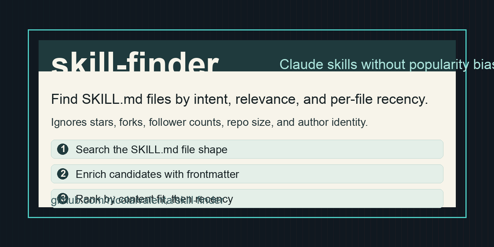

# Skill Finder



Find Claude skills by what they actually do, not by which repo already has the most stars.

`skill-finder` is a Claude/Codex skill for discovering `SKILL.md` files on GitHub. It searches for the file shape shared by Claude skills, enriches matches with frontmatter and per-file recency, then asks the agent to rank each candidate by content relevance instead of repo popularity.

## Why this exists

Searching GitHub for "skill" usually surfaces large collections and viral repos. That is useful, but it buries individual authors who published one excellent skill in a small repo.

This skill changes the search strategy:

- Finds `SKILL.md` files with Claude-style YAML frontmatter.
- Expands user intent into keywords and phrases before searching.
- Fetches the last commit date for each specific `SKILL.md`, not just repo activity.
- Ignores stars, forks, follower count, repo size, and author identity when ranking.
- Adds optional Reddit/X/blog cross-checks so newly shared skills are not missed.
- Can install a chosen skill into `~/.claude/skills/`.

## What is included

```text
SKILL.md
scripts/find_skills.py
scripts/install_skill.py
references/search_patterns.md
```

The scripts use only Python standard library plus the GitHub CLI.

## Requirements

- Python 3
- GitHub CLI: `gh`
- Authenticated GitHub CLI session: `gh auth status`
- Web search access from your agent for the Reddit/X/blog cross-check step

## Install

Clone this repo into your Claude skills directory:

```bash
mkdir -p ~/.claude/skills
git clone https://github.com/nicolaivalenta/skill-finder.git ~/.claude/skills/skill-finder
```

Or copy the folder into whichever skills directory your agent runtime reads.

## Use

Ask your agent for a Claude skill:

```text
Find me a Claude skill for invoice extraction.
Is there a skill for debugging SwiftUI performance?
Show me recent skills for Obsidian notes workflows.
```

The agent should:

1. Restate the intent.
2. Build keyword and phrase searches.
3. Run `scripts/find_skills.py`.
4. Cross-check Reddit/X/blog search results when available.
5. Rank candidates by content relevance first and per-file recency second.
6. Inline the most promising `SKILL.md` files.
7. Offer to install one only after you choose it.

## Direct script examples

```bash
scripts/find_skills.py \
  --keywords "invoice,receipt,expense,bookkeeping,tax" \
  --phrases "expense tracking,receipt extraction"
```

```bash
scripts/install_skill.py \
  https://github.com/owner/repo/blob/main/path/to/SKILL.md
```

`install_skill.py` refuses to overwrite an existing skill unless `--force` is passed.

## Privacy and safety

This repo does not contain API keys, personal machine paths, or user-specific configuration. It shells out to `gh` and only reads public GitHub metadata/content for discovery unless your authenticated GitHub account can see private repos in search results.

If you want strictly public-only discovery, run it from a GitHub account without private repo access or review the JSON output before sharing it.

## License

MIT
